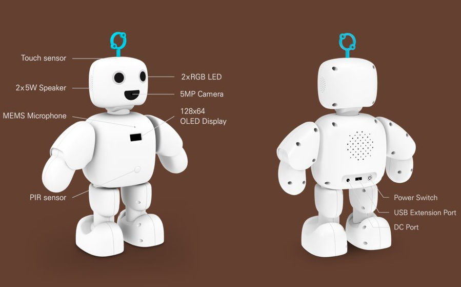
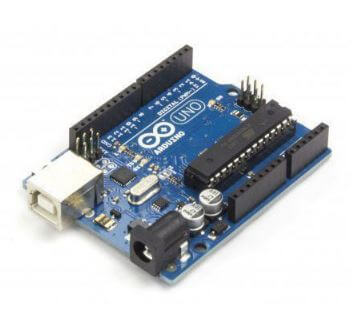

# 하드웨어

파이보의 부품에 관한 세부적인 설명을 다룹니다.

- Atmega328p

   

   - 자체 운영체제가 없어 외부 프로그램에서 C언어 형태로 프로그래밍하고 코드를 보드에 업로드하는 방식으로 동작합니다.
   - 주로 외부기기(센서, LCD, 모터) 제어에 많이 사용되며, 파이보에서는 PIR sensor, Neopixel, Touch sensor 제어에 사용합니다.

- PIR Sensor

   

   - 적외선 감지 센서
   - 일정한 적외선을 띈 움직임이 있는 물체를 감지합니다.
   - 무한 반복 트리거 동작 방식  
      HIGH 신호가 출력되는 Delay Time 내에 적외선 변화가 감지되면  
      출력 신호 Delay Time이 초기화되며 출력 신호 유지 상태에서 다시 카운트가 시작됩니다.  
      인체 또는 적외선 변화가 감지되지 않은 시점에서 2초 후 출력 신호는 LOW가 됩니다.

- Neopixel

   

   - WS281x 칩이 내장된 LED
   - 어떤 모양이든 연결 가능하며 연결 배선이 간단합니다.
   - 단일 핀으로 모든 LED 개별 제어가 가능합니다.

- Touch Sensor

   

   - PCB 하단의 터치패드를 터치하면 터치 인식
   - 기구물에 부착하여 사용합니다. (두께 3T 이하)
   - 전원인가 시 초기 출력 HIGH, 터치 시 OUTPUT LOW

- Servo Motor

   

   - 최대 180도까지 움직일 수 있는 서보모터
   - PWM으로 통신하여 모터의 각도를 조회할 수 있습니다.

- OLED

   

   - 데이터를 화면에 출력합니다.
   - SSD1306 chip을 사용하고, 통신 방식에 따라 SPI Type, I2C Type이 존재합니다.

- Microphone

   

   - 소리를 녹음합니다.
   - MEMS방식으로 매우 소형이며, I2S 방식을 사용합니다.

- Camera

   

   - Raspberrypi Camera v1.3과 호환되는 카메라입니다.
   - 5 Megapixel로 촬영이 가능합니다.
