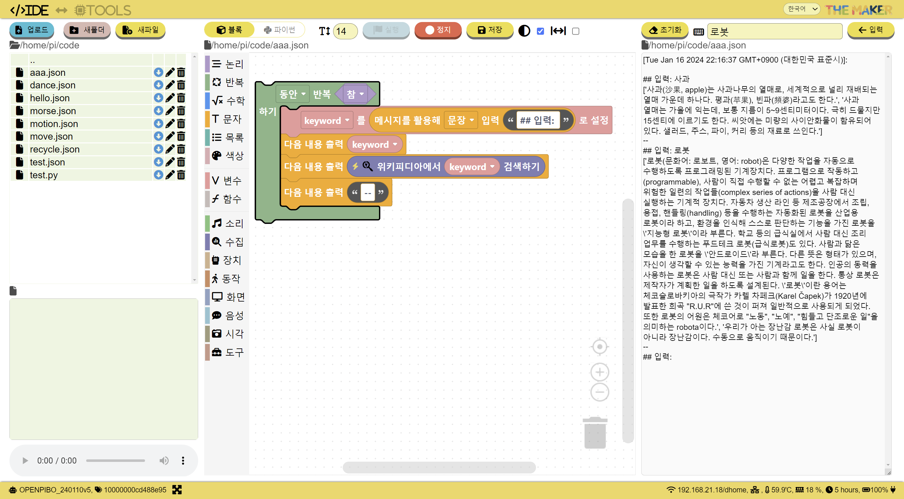

# 파이보 메이커

파이보 메이커는 로봇의 개별 기능을 체험하고 제어할 수 있는 **Tools**, Python, Block코딩 개발환경인 **IDE**를 제공합니다.

## Tools

**Tools** 섹션에서는 로봇을 구성하는 모터, 센서, 카메라, 마이크 등의 하드웨어와 소프트웨어를 제어할 수 있는 도구를 제공합니다.

로봇의 기능을 독립적으로 테스트하고 제어함으로써 로봇의 작동 방식과 동작을 이해할 수 있습니다.

예를 들어, 로봇의 움직임을 시뮬레이션하거나 실제 모터를 동작시켜 볼 수 있고, 로봇이 주변 환경을 감지하는 능력을 시험하고 데이터를 확인할 수 있습니다.
이러한 도구들을 통해 로봇의 개별 기능을 체험하고 제어함으로써 로봇의 작동 원리를 이해할 수 있습니다.

  

  

  

## IDE
**IDE** 는 개발 환경으로 Python과 Block 코딩을 지원하고, 이미지/오디오 player, 탐색기, 로그 뷰어 등을 제공합니다.

Python은 강력한 프로그래밍 언어로 다양한 기능과 라이브러리를 활용하여 로봇의 인공지능 기능을 개발할 수 있습니다.

Block 코딩은 시각적인 블록을 조합하여 프로그램을 작성하는 방식으로, 프로그래밍 경험이 없는 사람들도 쉽게 로봇의 기능을 구현하고 활용할 수 있습니다.

  

  

  

  