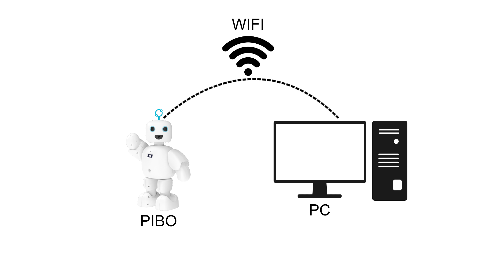
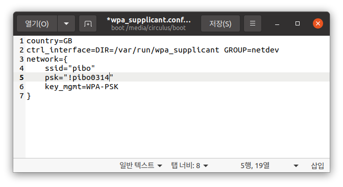
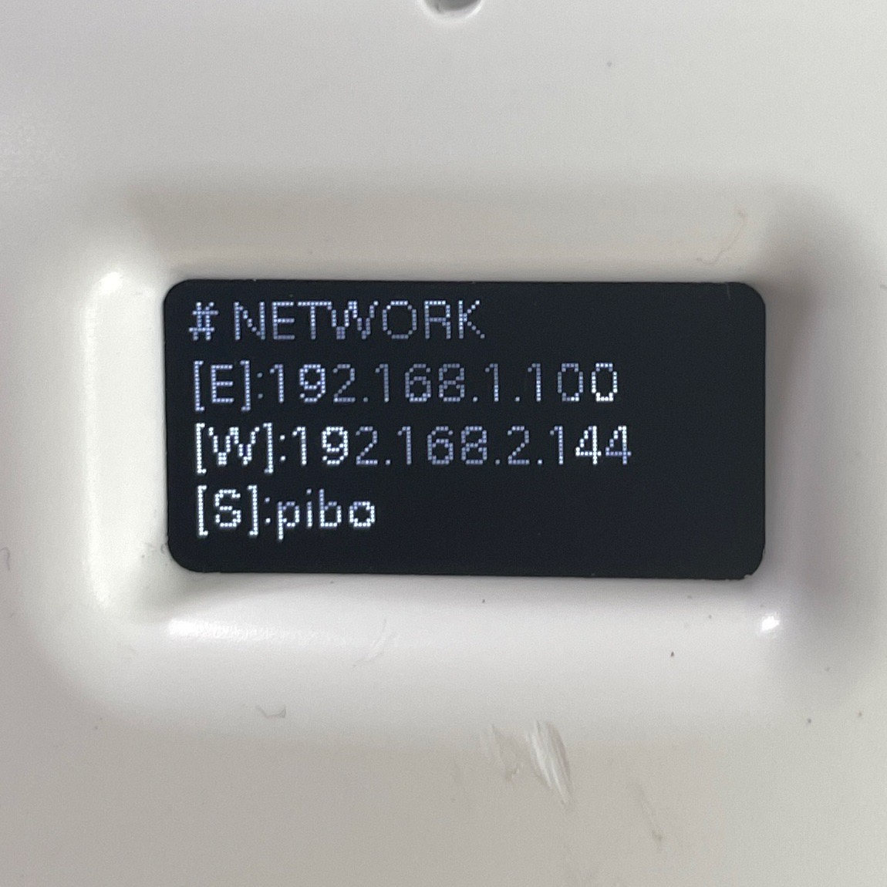
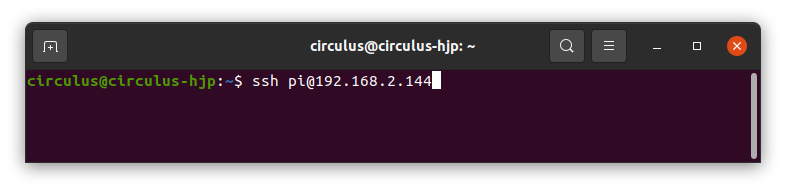
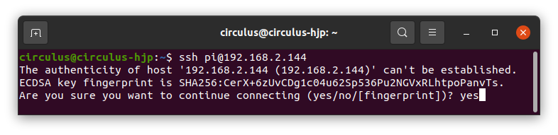
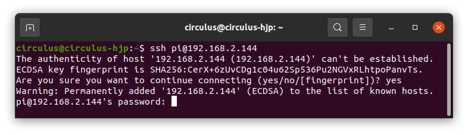
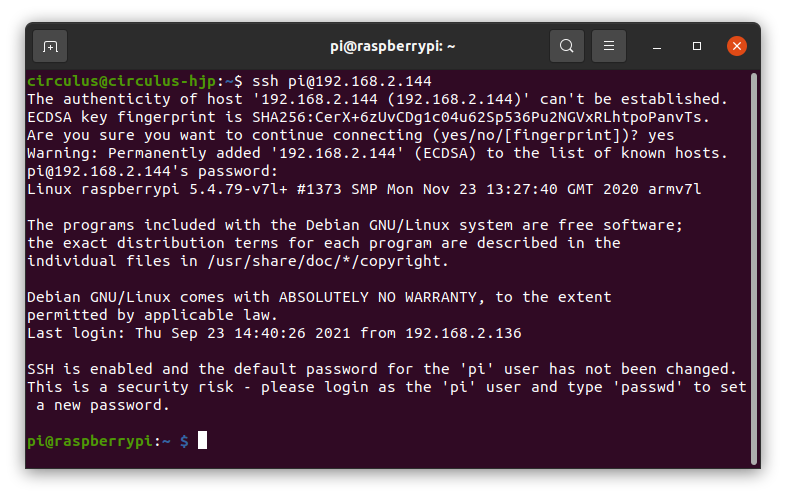

# 설정

서큘러스가 제공하는 OS와 openpibo API를 사용하는 데 필요한 사전 설정을 다룹니다.

OS는 파이보 DIY 키트에 포함되어 있으며, 이후 [여기](https://github.com/themakerrobot)에서 다운로드 받을 수 있습니다. openpibo API는 [깃허브](https://github.com/themakerrobot/openpibo-python)에 업로드 하였으며, 누구나 다운로드 받아 활용할 수 있습니다.

## 무선 네트워크 설정

파이보를 사용하기 위해서는 파이보와 PC가 같은 네트워크에 접속해야 합니다.



이를 위해 선행해야 할 것은 다음 절차를 따라 파이보를 무선 네트워크에 연결하고 IP주소를 확인하는 것입니다.

1. 파이보 DIY 키트에 포함된 MicroSD 카드를 리더기에 연결하고 컴퓨터 USB 포트에 연결합니다.

   

2. MicroSD 카드의 `boot` 폴더에서 `wpa_supplicant.conf` 파일을 수정합니다.

   *<참고> PC에 .conf 파일 편집기가 설치되어있지 않다면 확장자를 .txt로 변경한 후 수정할 수 있습니다.*

   

   - ssid: 연결할 wifi 이름입니다.
   - psk: 연결할 wifi의 비밀번호입니다.

   ```
   network={
      ssid="pibo"
      psk="!pibo0314"
      key_mgmt=WPA-PSK
   }
   ```

   wifi의 비밀번호가 없는 경우, psk를 입력하지 않고,  
   key_mgmt에 WPA-PSK 대신 NONE을 입력합니다.

3. 컴퓨터에서 MicroSD 카드를 분리한 후 파이보에 연결합니다.

   

4. 파이보를 부팅하고 설정한 무선 네트워크 정보가 정상적으로 보이는지 확인합니다.

   

   - W: 파이보의 IP주소입니다.
   - S: 파이보가 접속한 wifi의 ssid 입니다.

**[주의] 파이보를 부팅하게 되면 네트워크 설정이 완료된 후 `wpa_supplicant.conf` 파일이 사라집니다.**

새로운 네트워크에 접속하려면, `wqa_supplicant.conf.example` 파일을 복사한 후, 파일명을 `wpa_supplicant.conf`로 변경하여 사용할 수 있습니다.

## SSH 연결

SSH란, 원격 컴퓨터에 접속하기 위해 사용하는 보안 프로토콜로 파이보와 실습에 사용할 컴퓨터가 같은 네트워크에 있다면 파이보에 접속할 수 있습니다.
SSH를 통해 파이보에 접속하고 파이보를 제어하거나 필요한 소프트웨어를 설치할 수 있습니다.

다음의 절차를 따라 SSH를 이용하여 파이보에 원격 접속합니다.

1. 접속할 파이보의 IP주소, ID, PASSWORD를 확인합니다.  

   **IP주소    : 파이보의 OLED에서 확인할 수 있습니다.**  
   **ID       : pi**  
   **PASSWORD : raspberry**  

2. 컴퓨터에서 사용할 SSH 프로그램을 확인합니다. 운영체제에 내장된 프로그램으로 무료로 사용할 수 있으며, 이하 `터미널`로 용어를 통일합니다.  

   **윈도우   : PowerShell**  
   **맥/리눅스: Terminal**  

3. 터미널을 열고 원격 접속할 파이보 정보를 입력합니다. 정보를 입력하는 규칙은 다음과 같습니다.  

   **규칙: ssh ID@접속할 IP주소**  
   **예: ssh pi@192.168.2.144**  
   

4. 보안 설정에 동의합니다. 이는 최초 접속할 때만 출력되는 메시지입니다.

   

5. 패스워드를 입력합니다. 이때 패스워드가 별도로 표시가 되지 않기 때문에 오타에 주의하며 작성합니다.

   

6. SSH 접속을 확인합니다.

   


## openpibo 및 관련 패키지 설치

openpibo 및 관련 패키지는 OS에 설치되어 있지만, 필요에 따라 다시 설치할 수 있습니다.

- openpibo 설치

   파이보를 조작하는 기능이 들어있는 파일 모음입니다. 파이보 모션 제어, 오디오 재생 등에 필요한 패키지입니다.
   터미널에 아래와 같이 입력합니다.

   ```bash
   $ sudo pip3 install openpibo-python # sudo 권한이 필요합니다.
   ```
- openpibo-tools 설치

   전자부품 상태 확인, 모션 제작 등에 필요한 실행 파일이 담긴 패키지입니다. 설치 방법은 다음과 같습니다.

   ```bash
   $ git clone https://github.com/themakerrobot/openpibo-tools.git
   ```

   자세한 기능 및 사용 방법은 아래의 링크를 참고합니다.

   - [Process Test](https://themakerrobot.github.io/openpibo-python/build/html/tools/process_test.html)
   - [Motion Creator](https://themakerrobot.github.io/openpibo-python/build/html/tools/motion_creator.html)
   - [Device Simulator](https://themakerrobot.github.io/openpibo-python/build/html/tools/device_simulator.html)

- openpibo-files 설치

   openpibo에서 사용 가능한 샘플 오디오, 아이콘, 이미지 파일 등이 담긴 패키지입니다.
   설치 방법은 다음과 같습니다.

   ```bash
   $ git clone https://github.com/themakerrobot/openpibo-files.git
   ```

   자세한 내용은 아래의 링크를 참고합니다.

   - [Audio](https://themakerrobot.github.io/openpibo-python/build/html/files/audio.html)
   - [Icon](https://themakerrobot.github.io/openpibo-python/build/html/files/icon.html)
   - [Image](https://themakerrobot.github.io/openpibo-python/build/html/files/image.html)

- openpibo-examples 설치

   openpibo를 사용한 예제 파일이 담긴 패키지입니다. 패키지 안에 있는 파이썬 파일을 실행하여 결과를 확인할 수 있고, 참고하여 프로그램을 만드는 데 활용할 수 있습니다. 일부 파일에 사용하는 데이터는 openpibo-files에 있으므로 openpibo-files가 미리 설치되어 있어야 하며 설치 방법은 다음과 같습니다.

   ```bash
   $ git clone https://github.com/themakerrobot/openpibo-examples.git
   ```

## KAKAO Developer Key 발급

openpibo에서 음성인식(STT)과 음성합성(TTS)을 위해 KAKAO를 사용합니다. KAKAO Developers에서 회원가입 및 Key 발급이 필요하며, 발급받는 방법은 [여기](https://themakerrobot.github.io/openpibo-python/build/html/notes/kakao_api.html)를 참고합니다.

발급받은 Key는 파이보의 /home/pi/에 있는 config.json 파일에 다음과 같이 저장합니다.

```json
{
   "DATA_PATH":"/home/pi/openpibo-files",
   "KAKAO_ACCOUNT": "<여기에 발급받은 REST API 키를 입력해주세요>",
   "robotId": ""
}
```
