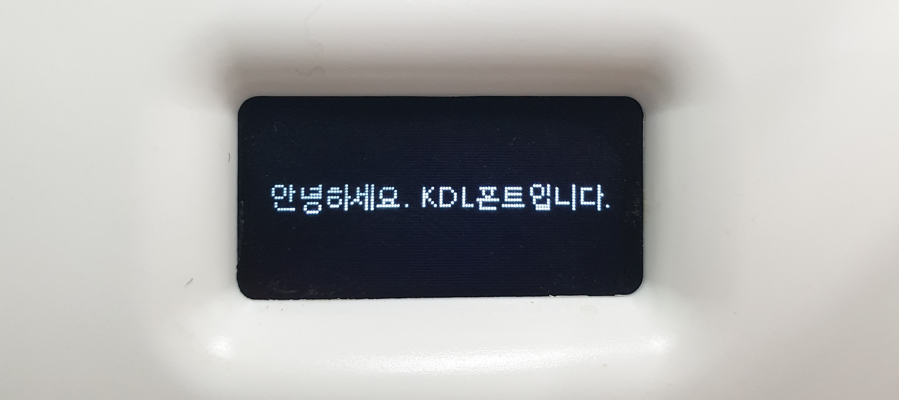

# 라이브러리 구조

openpibo / openpibo_models 패키지 구조에 관해 설명합니다.

openpibo 패키지는 파이보를 제어하기 위한 내부 modules과 libraries 부분으로 나뉘어 있습니다.
openpibo_models 패키지는 openpibo 패키지를 사용하기 위한 폰트/모션 파일, 인공지능 모델 등의 파일을 가지고 있습니다.

## openpibo/modules

라이브러리를 사용하는 데 필요한 각종 모듈입니다.

사용되는 라이브러리의 종류에 따라 분류되어있습니다.

```
modules
├── __init__.py
├── collect
│   ├── __init__.py
│   └── get_soup.py
├── oled
│   ├── __init__.py
│   ├── board.py
│   ├── busio.py
│   ├── chip.py
│   ├── digitalio.py
│   ├── framebuf.py
│   ├── pure_spi.py
│   ├── spi.py
│   ├── spi_device.py
│   ├── ssd1306.py
│   └── util.py
├── speech
│   ├── __init__.py
│   ├── constant.py
│   └── google_trans_new.py
└── vision
      ├── __init__.py
      └── stream.py
```

## openpibo/libraries

파이보의 다양한 기능을 사용할 수 있는 Class가 저장된 파일입니다.

```
openpibo
├── audio.py
├── collect.py
├── device.py
├── motion.py
├── oled.py
├── speech.py
├── vision.py
└── edu_v1.py
```

세부 가이드는 아래의 링크를 참조해주세요.

- [audio.py](https://themakerrobot.github.io/openpibo-python/build/html/libraries/audio.html)
- [collect.py](https://themakerrobot.github.io/openpibo-python/build/html/libraries/collect.html)
- [device.py](https://themakerrobot.github.io/openpibo-python/build/html/libraries/device.html)
- [motion.py](https://themakerrobot.github.io/openpibo-python/build/html/libraries/motion.html)
- [oled.py](https://themakerrobot.github.io/openpibo-python/build/html/libraries/oled.html)
- [speech.py](https://themakerrobot.github.io/openpibo-python/build/html/libraries/speech.html)
- [vision.py](https://themakerrobot.github.io/openpibo-python/build/html/libraries/vision.html)
- [edu_v1.py](https://themakerrobot.github.io/openpibo-python/build/html/libraries/edu_v1.html)


## openpibo_models
폰트 파일, 모션 데이터베이스, 그리고 각종 인공지능 모델 등 라이브러리를 사용하기 위한 최소한의 데이터가 들어있습니다.

```
models/
├── KDL.ttf
├── motion_db.json
├── sample_db.json
├── dialog.csv
├── MobileNetSSD_deploy.prototxt.txt
├── MobileNetSSD_deploy.caffemodel
├── deploy_age.prototxt
├── age_net.caffemodel
├── deploy_gender.prototxt
├── gender_net.caffemodel
├── dlib_face_recognition_resnet_model_v1.dat
├── haarcascade_frontalface_default.xml
└── shape_predictor_5_face_landmarks.dat
```

- **폰트**

   - **KDL.ttf**

      OLED에 텍스트를 출력할 때 사용하는 기본 글씨체입니다.

      

- **모션 데이터베이스**

   - **motion_db.json**
   
      파이보에 기본적인 동작이 저장되어있는 데이터베이스로, 저장된 모션 리스트는 다음과 같습니다.

      ```
      stop, stop_body, sleep, lookup, left, left_half, right, right_half, foward1-2,
      backward1-2, step1-2, hifive, cheer1-3, wave1-6, think1-4, wake_up1-3, hey1-2,
      yes_h, no_h, breath1-3, breath_long, head_h, spin_h, clapping1-2, hankshaking,
      bow, greeting, hand1-4, foot1-2, speak1-2, speak_n1-2, speak_q, speak_r1-2, 
      speak_l1-2, welcome, happy1-3, excite1-2, boring1-2, sad1-3, handup_r, 
      handup_l, look_r, look_l, dance1-5, motion_test, test1-4
      # foward1-2는 forward1, forward2 두 종류가 있음을 의미합니다.
      ```

   - **sample_db.json**
   
      모션 데이터베이스의 양식이 저장되어있습니다.

      ```json
      {
         "name": {
            "comment":"description of this motion",
            "init_def":0,
            "init":[0,0,-70,-25,0,0,0,0,70,25],
            "pos":[
               { "d": [ 0, 0, 0, 0, 0, 0, 0, 0, 0, 0 ] , "seq": 0 }
            ]
         }
      }
      ```

   새로운 모션을 만들기 위해서는 sample_db.json의 양식을 갖춰야 하며, [Motion Creator](https://themakerrobot.github.io/openpibo-python/build/html/tools/motion_creator.html)를 이용해 간편히 만들 수 있습니다.

- **대화 데이터셋**

   - **dialog.csv**

      질문과 답변 형식의 대화 데이터셋입니다.

      챗봇 기능을 사용할 때 질문에 대한 대답을 추론하기 위해 사용됩니다.
   
- **인공지능 모델**

   vision 라이브러리에서 사용되는 각종 인공지능 모델입니다.

   **prototxt** 파일은 인공지능 네트워크 구조가 담긴 파일이고, **caffemodel** 파일은 prototxt의 네트워크로 학습시킨 인공지능 모델입니다.

   - **MobileNetSSD_deploy.prototxt.txt, MobileNetSSD_deploy.caffemodel**

      객체 인식을 사용하기 위한 인공지능 네트워크 구조와 모델입니다.
   
   - **deploy_age.prototxt, age_net.caffemodel**

      인물의 나이를 가늠하기 위한 인공지능 네트워크 구조와 모델입니다.
   
   - **deploy_gender.prototxt, gender_net.caffemodel**

      인물의 성별을 추론하기 위한 인공지능 네트워크 구조와 모델입니다.
   
   아래는 얼굴인식을 위한 모델입니다.

   - **dlib_face_recognition_resnet_model_v1.dat** # face_encoder

      얼굴을 인식하여 Numpy 배열로 변환하는 인공지능 모델입니다.

   - **haarcascade_frontalface_default.xml** # face_detector

      얼굴을 검출하도록 미리 학습시켜 놓은 XML 포맷으로 저장된 검출기입니다.

   - **shape_predictor_5_face_landmarks.dat** # predictor

      얼굴에 5개의 특징점을 추출하여 표정을 예측하는 인공지능 모델입니다.
