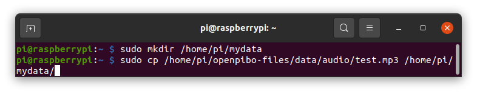
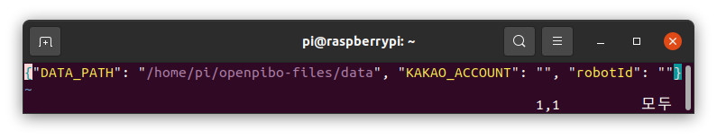
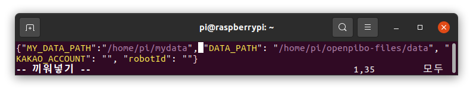
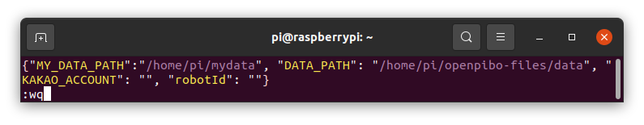

# 사용법

서큘러스가 제공하는 OS와 openpibo API를 사용하는 방법을 제공합니다.

## 사전 설정

OS는 파이보 DIY 키트에 포함되어 있으며, 이후 [여기](https://github.com/themakerrobot)를 통해 다운로드 받을 수 있습니다. openpibo API는 [깃허브](https://github.com/themakerrobot/openpibo-python)에 업로드 하였으며, 누구나 다운로드 받아 활용할 수 있습니다.

1. 기본 네트워크 정보
   초기에 ssid:'pibo', password:'!pibo0314'으로 설정되어 있습니다.
   추후, '/boot/wpa_supplicant.conf' 파일을 통해 수정할 수 있습니다. ('/boot/wpa_supplicant.conf' 없다면, '/boot/wpa_supplicant.conf.example' 파일을 '/boot/wpa_supplicant.conf'로 복사하신 후, 작업을 이어가시면 됩니다.)

2. AP-STA모드 지원
   부팅 시, pibo-[라즈베리파이 시리얼번호]를 ssid로 AP모드가 동작합니다.
   192.168.34.0/24 대역으로 AP모드가 동작되며, 로봇(게이트웨이 주소는 192.168.34.1 입니다.)

3. KAKAO Developer Key 발급
   openpibo에서 음성인식(STT)과 음성합성(TTS)을 위해 KAKAO를 사용합니다. KAKAO Developers에서 회원가입 및 Key 발급이 필요합니다.

   발급받은 Key는 파이보의 /home/pi/에 있는 config.json 파일에 다음과 같이 저장합니다.

   ```json
   {
      "datapath":"/home/pi/openpibo-files",
      "kakaokey": "<여기에 발급받은 REST API 키를 입력해주세요>",
      "robotid": ""
   }
   ```

## 라이브러리 사용

openpibo 패키지를 사용하는 방법 audio 라이브러리를 통해 설명합니다.

```python
from openpibo.<라이브러리 명> import <클래스 명>

<인스턴스 명> = <클래스 명>()
<인스턴스 명>.<메소드명>(<인자>)
```

예) audio 라이브러리의 Audio 클래스의 함수를 사용하는 방법은 다음과 같습니다.

```python
from openpibo.audio import Audio

pibo_audio = Audio()

# play 메소드: 오디오 파일을 재생합니다.
pibo_audio.play('/home/pi/openpibo_files/audio/test.mp3')

# stop 메소드: 재생 중인 오디오 파일을 중지합니다.
pibo_audio.stop()

# mute 메소드: 음소거 모드로 전환합니다.
pibo_audio.mute(True)

# pibo_audio 는 Audio 클래스의 인스턴스
```

Libraries 탭을 참고하시기 바랍니다.

## 데이터 경로 설정

어떤 메소드는 인자로 파일 경로를 입력해야 합니다.

파일 경로를 입력하는 방법에 관해 설명하며,  
추가로 /home/pi/openpibo_files/audio/ 경로에 있는 test.mp3 파일 재생 방법을 예시로 활용합니다.

1. 절대 경로를 사용하는 방법

   절대 경로란, 파일이 가지고 있는 고유한 경로를 말합니다. 경로가 최상위 디렉터리부터 시작되는 특징이 있습니다.

   test.mp3 파일을 재생하는 메소드는 다음과 같습니다.

   ```python
   pibo_audio.play('/home/pi/openpibo_files/audio/test.mp3')
   # pibo_audio 는 Audio 클래스의 인스턴스
   ```

   위 예시에서 `test.mp3`의 경로는 `'/home/pi/openpibo_files/audio/test.mp3'` 입니다.

2. 상대 경로를 사용하는 방법

   상대 경로란, 현재 위치한 디렉터리를 기준으로 해서 대상 파일의 상대적인 경로를 의미합니다.

   현재 디렉터리 위치가 /home/pi/ 일때 test.mp3 파일의 상대 경로는 다음과 같습니다.

   ```python
   # 현재 디렉터리: /home/pi/
   pibo_audio.play('openpibo_files/audio/test.mp3')
   ```

   위 예시에서 `test.mp3`의 경로는 `'openpibo_files/audio/test.mp3'` 입니다.

3. 미리 지정해둔 경로를 참조하는 방법

   config.json 파일에 미리 지정해둔 경로를 호출하여 사용할 수 있습니다.

   기본적으로 config.json에는 'datapath' key의 value로 '/home/pi/openpibo_files' 경로가 설정되어있습니다.

   python에서 config.json을 호출하는 방법은 다음과 같습니다.

   ```python
   import openpibo

   print(openpibo.config)
   # {'datapath': '/home/pi/openpibo-files', 'kakaokey': '*****', 'robotid': ''}
   ```

   이를 활용하여 test.mp3 파일의 경로를 다음과 같이 입력할 수 있습니다.

   ```python
   pibo_audio.play(openpibo.datapath+'/audio/test.mp3')
   ```

   위 예시에서 `test.mp3`의 경로는 `openpibo.datapath+'/audio/test.mp3'` 입니다.

   *[참고] config.json 파일을 수정하여 데이터 경로를 커스텀하여 사용할 수도 있습니다.*

   1. 데이터를 저장할 디렉터리를 생성하고 파일을 저장합니다.

      - /home/pi/ 경로에 mydata 디렉터리를 생성합니다.
      

      - 생성한 디렉터리에 test.mp3 파일을 복사합니다.
      

   2. config.json 파일을 수정합니다.

      ```bash
      $ sudo vi /home/pi/config.json # config.json 파일 에디터를 실행합니다.
      ```

      

      - i 키를 누르면 끼워넣기 모드가 활성화됩니다. 이때 키보드 타이핑을 하면 글씨가 입력됩니다.

      

      - 입력을 마치면, esc 키를 눌러 끼워넣기 모드를 종료합니다. 이후 `:wq` 를 타이핑하여 파일을 저장하고 종료합니다.

      

   3. 경로를 호출해서 사용합니다.

      ```python
      import openpibo

      pibo_audio.play(openpibo.MY_datapath+'/test.mp3')
      ```

      위 예시에서 `test.mp3`의 경로는 `openpibo.MY_datapath+'/test.mp3'` 입니다.
